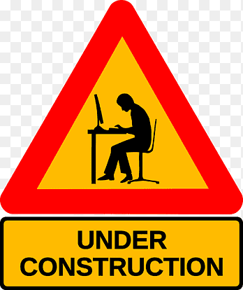

# Modelarnia Ratuszowa - Nowa Dęba    

## Demo:

https://jacekdu.github.io/Modelarnia_Ratuszowa/
#

## Description:

The idea is to rebuild the existing website of a local modellers club and make it more responsive.

The ability to view a website on devices with different screen sizes seems to be essential these days.

GitHub provides an excellent platform for practicing new protocols during rebuilding an existing site,

and allows us to control all changes during the reconstruction.

So far in Polish only.

## Tools - to be used:

- HTML - Living Standard,
- CSS,
- Javascript - ECMAScript 2020,
- BEM convention,
- Normalise.css,
- The OpenGraph Protocol.
